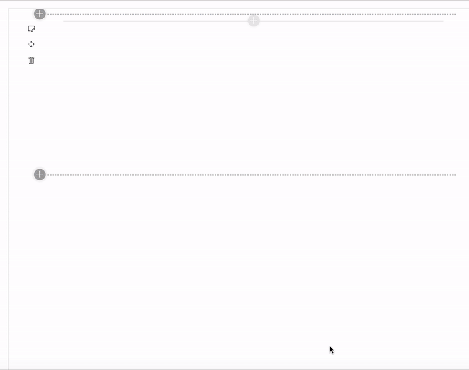

# SPSISTANBUL 2019 Sample WebPart and Slide

## Preview

## Slide

* [SPFx CI/CD Pipelines on Azure DevOps](https://github.com/serdarketenci/spsistanbul2019/blob/master/slides/SPFx%20CI%20CD%20Pipelines%20on%20Azure%20DevOps.pdf)

## Features

* Custom List Instance with custom list schema.
* Content Types.
* Fields.
* Pre-populated List Data Rows in the Elements.xml.
* Jest & Jest Snapshots
* Azure Pipelines
* SonarQube Integration
* React Hooks